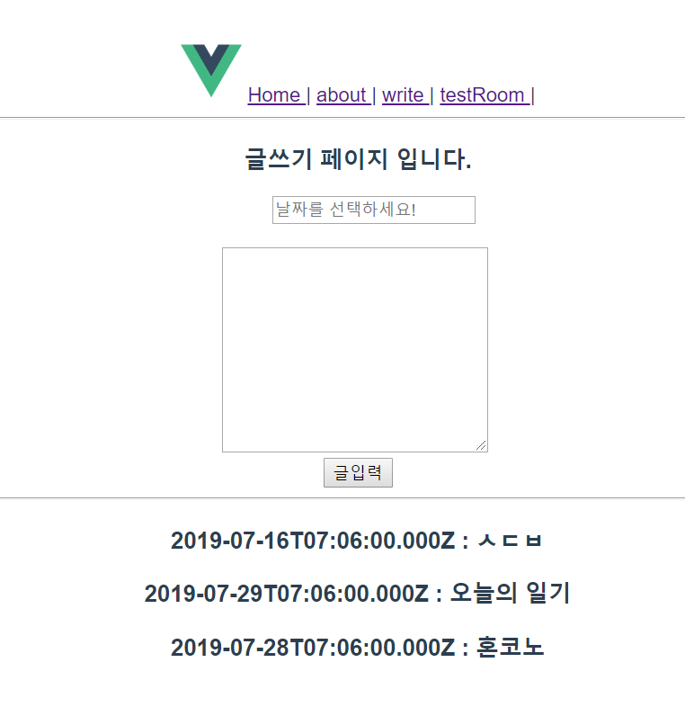
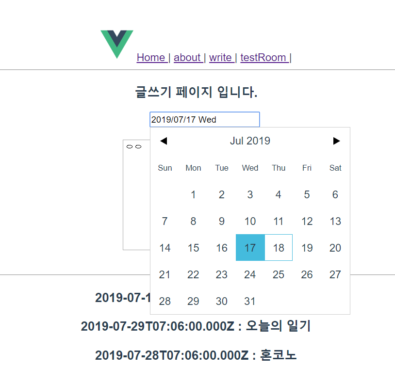

# vue_and_spring2
- Vue.js 와 Spring 연동 예제 2번째! 
- 첫번째 예제에 이어서

## 사용 기술 및 라이브러리
- Spring boot
- Vue
- rest API (Json형식)
- Axios  (통신을 위함)
- Vue Router (깜빡임 없이 화면 전환, SPA)
- vuejs-datepicker (날짜 선택)
- moment (날짜 포맷 정해줌, 하지만 백단 넘겨 줄 때는 적용이 안됨 ㅠ)

## 구현 내용
- 데이터 통신 왔다리 갔다리
- Spring boot 에서 만든 REST API를 읽어와서 Vue.js에 뿌리고
- Vue.js에서 입력한 값들을 Rest에 PUT하고 Spring 콘솔창에 출력하기
+ datePicker 라이브러리를 이용하여 날짜 받아오고 이를 백단으로 넘김

  
  

## 참고 블로그
https://handcoding.tistory.com/196
